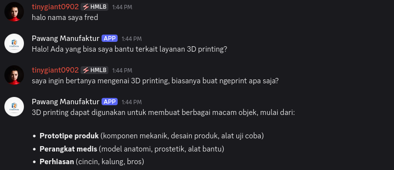
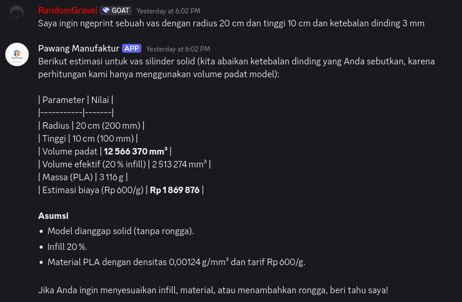

Anggota Kelompok:
1. Fidelya Fredelina (22/496507/TK/54405)
2. M Rafli Ramadani (22/497787/TK/54571)

# 🧠 PrintAI — LLM Agent untuk Layanan Pelanggan 3D Printing

PrintAI adalah **LLM Agent berbasis LangChain dan LangGraph** yang berperan sebagai asisten layanan pelanggan untuk bisnis 3D printing bernama **Fred’s Print**.  
Agent ini tidak hanya bisa menjawab percakapan teks, tapi juga **melakukan perhitungan nyata** seperti menghitung **volume, luas permukaan, dan biaya cetak model 3D** menggunakan *tools* terintegrasi.

---






## 🚀 Fitur Utama

- 💬 **Conversational AI:** Berinteraksi dengan user melalui **Discord bot**.  
- 🧮 **Tools terintegrasi:**  
  - `geometry_3d` → menghitung volume & luas permukaan bentuk 3D.  
  - `estimate_cost` → menghitung berat model & estimasi biaya cetak (berdasarkan densitas dan harga material).  
- 💾 **Short-Term Memory:** Agent mengingat konteks percakapan (nama user, model yang dibahas, dsb).  
- 🧠 **Reasoning System:** Menggunakan pola *ReAct* (Reason → Action → Observation → Final Answer).  
- 🧩 **Modular Structure:** Mudah dikembangkan — tools, model, dan sistem memory terpisah.  
- ⚙️ **Model:** `llama-3.3-70b-versatile` via **Groq API**.  

---

## 📂 Struktur Proyek

```
3D-Print-LLM/
├─ src/
│  ├─ tools/
│  │  ├─ geometry.py           # Tool perhitungan bentuk 3D
│  │  ├─ estimate_cost.py      # Tool estimasi harga berbasis massa
│  │  └─ __init__.py           # Mendaftarkan semua tools
│  ├─ app.py                   # Core agent & reasoning logic
│  ├─ main_discord.py          # Integrasi Discord bot
│  └─ __init__.py
│
├─ tests/
│  ├─ unit/                    # Unit test untuk tools & fungsi kecil
│  └─ integration/             # Tes memori & alur penuh agent
│
├─ .env.example                # Template variabel lingkungan
├─ requirements.txt
├─ README.md
└─ LICENSE (optional)
```

## Instalasi

1. Lakukan git clone project,
```
git clone github.com/IniDani/3D-Print-LLM
cd 3D-Print-LLM
```
2. Buat virtual environment dan install semua dependencies

```
python -m venv .llm
source .llm/bin/activate
pip install -r requirements.txt
```

3. Masukkan token yang diperlukan di file .env, referensi ada di .env.example

4. Jalankan bot dengan menggunakan
```
python3 src/main_discord.py
```

5. (Optional) Testing bisa dilakukan menggunakan

```
python -m pytest -q
```


## Useful Links

Link video YouTube:\
https://youtu.be/FPzwacJWM3c

Link Medium: \
https://fidelyafr.medium.com/proyek-3d-printer-chatbot-berbasis-llm-agent-73009c37f602
